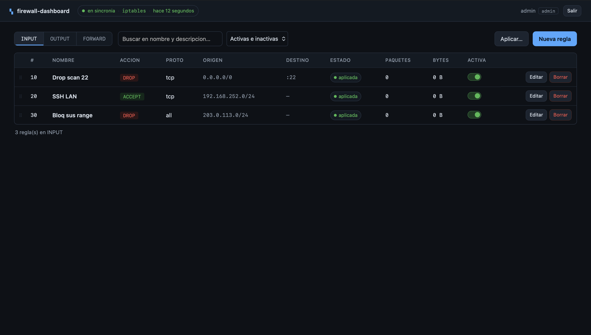
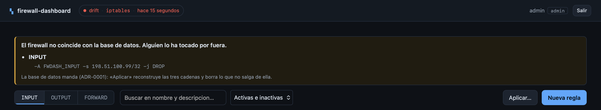
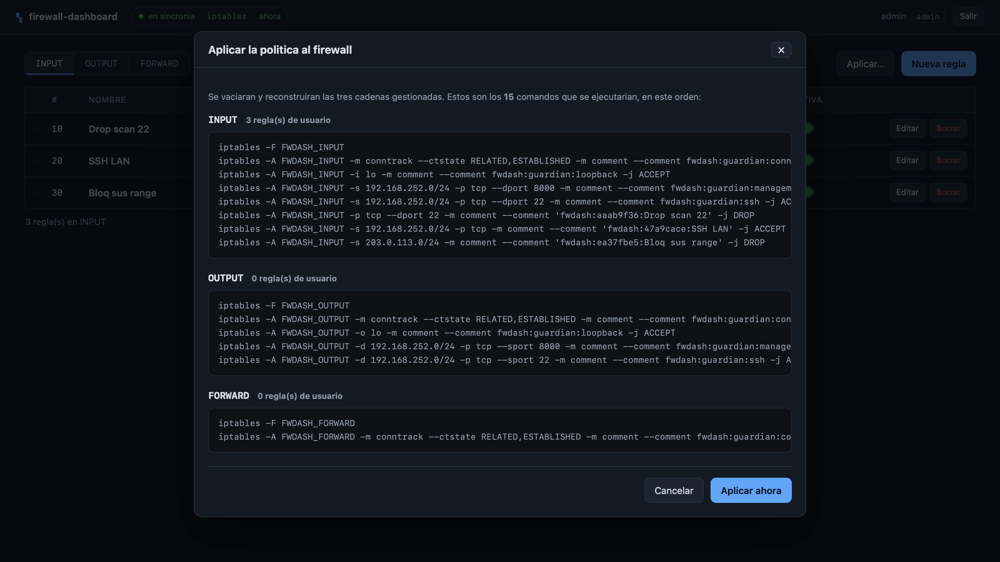
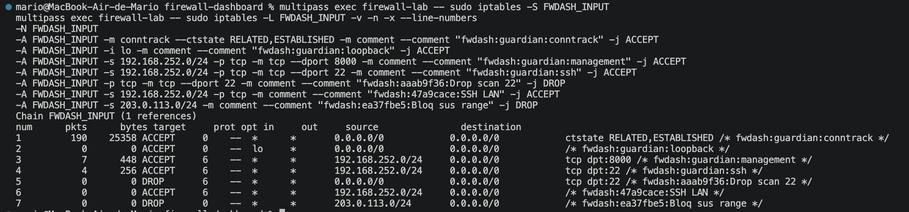

<div align="center">

# firewall-dashboard

**Gestión de reglas de iptables con dashboard web, sobre una VM Linux.**

Proyecto de portfolio de ciberseguridad defensiva.


</div>

---

> ⚠️ **Laboratorio, no producto.** Corre en una VM aislada y modifica reglas de
> firewall reales. No lo despliegues en una máquina que te importe sin leer antes
> [`docs/SECURITY.md`](docs/SECURITY.md) y [`docs/RUNBOOK.md`](docs/RUNBOOK.md).

## Qué es

Una aplicación web para definir, aplicar y auditar reglas de `iptables` sobre una
VM Ubuntu. El objetivo no es sustituir a `ufw`, sino construir —y poder explicar—
una herramienta que ejecuta comandos privilegiados a partir de entrada de usuario
sin que eso sea una vulnerabilidad.

Las decisiones interesantes del proyecto están en `docs/adr/`, un ADR por
decisión, con las opciones descartadas y por qué.

## Por qué está construido así

**La base de datos es la fuente de verdad, no iptables** ([ADR-0001](docs/adr/0001-db-como-fuente-de-verdad.md)).
Una regla lleva quién la creó, cuándo y por qué. Nada de eso cabe en iptables.

**Cadenas propias, reconstrucción idempotente** ([ADR-0002](docs/adr/0002-cadena-propia-fwdash.md)).
La aplicación nunca escribe en `INPUT`: crea `FWDASH_INPUT`, `FWDASH_OUTPUT` y
`FWDASH_FORWARD` con un único salto hacia cada una. "Aplicar" significa siempre lo
mismo —vaciar la cadena gestionada y reconstruirla entera desde la base de datos—,
lo que la hace idempotente y garantiza que jamás se toquen reglas ajenas.

**Capabilities en lugar de sudo** ([ADR-0003](docs/adr/0003-privilegios-sudo-vs-capabilities.md)).
`NOPASSWD` sobre `iptables` es, en la práctica, equivalente a root. `CAP_NET_ADMIN`
es exactamente el permiso necesario y nada más.

**Backend de firewall intercambiable** ([ADR-0004](docs/adr/0004-backend-intercambiable-para-desarrollo-sin-vm.md)).
`FIREWALL_BACKEND=fake|iptables`. El MVP completo se construye y se demuestra en
el host, sin VM y sin privilegios.

**Las reglas se comparan por estructura, nunca por texto** ([ADR-0006](docs/adr/0006-comparar-reglas-por-estructura.md)).
iptables reescribe cada regla al guardarla: `--dport 22` vuelve como
`-p tcp -m tcp --dport 22`, `echo-request` vuelve como `8` y un `REJECT` vuelve con un
`--reject-with` que nadie pidió. Un detector de drift que compare texto daría divergencia
siempre, incluso justo después de aplicar. Se comparan `RuleSpec`, que se construyen
normalizadas. Lo descubrió una expedición de reconocimiento a la VM **antes** de escribir
el parser, y las salidas literales que capturó son hoy las fixtures de los tests.

**Escribir la política y aplicarla son dos pasos con dos contratos** ([ADR-0011](docs/adr/0011-escribir-la-politica-y-aplicarla-son-dos-pasos.md)).
Si crear una regla funciona pero iptables falla, `POST /rules` devuelve 201 con
`sync_state: failed` y el error saneado, no un 502: la regla existe, porque la fuente de
verdad es la base de datos. `POST /firewall/apply` sí devuelve 502, porque ahí lo único que
se ha pedido es aplicar. La consecuencia es que el estado de sincronización deja de ser
decorativo y se convierte en el contrato de error de la API.

**Lo que el sistema dice y no se entiende, no se descarta** ([ADR-0007](docs/adr/0007-nativerule-lleva-la-spec-parseada.md)).
Una regla dentro de una cadena gestionada que el modelo no sabe expresar es exactamente el
drift que hay que detectar, así que el parser la devuelve marcada en vez de ignorarla.

### La contención contra inyección de comandos

Es la amenaza principal de un proyecto que convierte formularios en comandos de
sistema. Cinco capas, ninguna suficiente por sí sola:

1. `subprocess.run(argv, shell=False)`, argumentos siempre en lista. Sin shell, la
   inyección deja de ser posible **por construcción**.
2. `subprocess` se importa en **un único archivo** del repositorio.
3. Allowlist de binarios ejecutables.
4. `RuleSpec` inmutable y validada al construirse: no existe ruta de código capaz
   de fabricar una spec inválida.
5. Normalización canónica de IPs y puertos.

Las capas 2 y 3 no dependen de la disciplina de nadie:
[`tests/unit/test_architecture.py`](backend/tests/unit/test_architecture.py) falla
en CI si alguien las cruza.

## Arquitectura

```
┌──────────────── HOST  ─────────────────┐   ┌──────── VM: firewall-lab ─────────┐
│                                        │   │                                   │
│   React + TypeScript (Vite)            │   │   FastAPI                         │
│         │                              │   │     │                             │
│         │  HTTP + JWT                  │   │   services/   lógica de negocio   │
│         └──────────────────────────────┼───┼──►  │                             │
│                                        │   │   firewall/   único con subprocess│
│                                        │   │     │                             │
│                                        │   │   SQLite      fuente de verdad    │
│                                        │   │     │                             │
│                                        │   │   iptables    FWDASH_INPUT/…      │
└────────────────────────────────────────┘   └───────────────────────────────────┘
```

Las dependencias van en una sola dirección: `api/ → services/ → firewall/ + models/`.
Un router nunca importa `firewall/`; un servicio nunca importa `fastapi`; el
paquete `firewall/` no sabe que existe una base de datos.

Detalle completo en [`docs/ARCHITECTURE.md`](docs/ARCHITECTURE.md).

## Puesta en marcha

### Bloque A — todo en el host, sin VM

No hace falta Multipass ni privilegios: el backend corre con un firewall en
memoria.

```bash
git clone <url> && cd firewall-dashboard

# Backend
cd backend
cp .env.example .env                       # FIREWALL_BACKEND=fake ya viene puesto
python3 -m venv .venv && source .venv/bin/activate
pip install -e ".[dev]"
alembic upgrade head
uvicorn app.main:app --reload

# Frontend, en otra terminal
cd frontend
cp .env.example .env
npm install && npm run dev
```

API en `http://127.0.0.1:8000` (documentación interactiva en `/docs`), frontend en
`http://127.0.0.1:5173`. Entra con el administrador que creó `make seed`.

Los tipos del frontend salen del OpenAPI y están versionados, así que un clon limpio compila
sin levantar nada. Cuando cambie un schema del backend, con el backend en marcha:

```bash
make gen-api      # regenera frontend/src/api/schema.d.ts
make front-check  # backend + gen:api + typecheck + lint + build, todo de una
```

### Windows

El `Makefile` y los scripts de `infra/scripts/` están escritos en bash, así que
la vía más simple es correr todo dentro de **WSL2** (Windows Subsystem for
Linux): ahí el resto de esta guía —Bloque A, `make`, Multipass— funciona
igual que en Linux/macOS, sin traducir ningún comando.

```powershell
wsl --install -d Ubuntu     # una vez; reinicia si te lo pide
```

Dentro de la distribución Ubuntu de WSL2:

```bash
sudo apt update && sudo apt install -y python3-venv python3-pip make
# clona el repo y sigue el Bloque A tal cual
```

Multipass se instala en Windows, no dentro de WSL2 (necesita Hyper-V):

```powershell
winget install Canonical.Multipass
```

El binario queda en el `PATH` de Windows y WSL2 lo ve automáticamente, así que
`make vm-provision`, `make vm-sync` y el resto de comandos de la VM ([`docs/SETUP_VM.md`](docs/SETUP_VM.md))
funcionan sin cambios desde la misma terminal de WSL2.

Si prefieres no instalar WSL2, la alternativa es **Git Bash** (incluido en
[Git for Windows](https://git-scm.com/download/win)): cubre bash y los scripts,
pero `make` no viene incluido — instálalo aparte (`choco install make` con
[Chocolatey](https://chocolatey.org/)) o ejecuta a mano los comandos que hay
detrás de cada target del `Makefile`.

### Bloque B/C — la VM

Ver [`docs/SETUP_VM.md`](docs/SETUP_VM.md). Resumen:

```bash
make vm-provision   # recrear firewall-lab desde cero y verificarla (B0)
make vm-sync        # llevar dentro lo commiteado (ADR-0013)
make vm-deploy      # desplegar en /opt de la VM: venv, .env, DB (B1)
make vm-b1          # comprobar los privilegios del servicio (B1)
make recon          # capturar fixtures de iptables (SOLO LECTURA)

# Bloque B — la capa de iptables real, medida
make b4-verify      # provocar el auto-bloqueo con la reversion armada antes (B4)
make b5-verify      # la suite de contrato contra iptables real (B5)

# Bloque C — la interconexion, de una pasada
make c-front        # apuntar frontend/.env a la IP que tenga la VM ahora (C1)
make c-verify       # red, cambio a iptables real, arranque, drift y recorrido
make c-verify FASE=c3   # una fase suelta: c0 | c1 | c2 | c3 | c4
```

`make c-verify` **modifica configuración y reglas reales** de la VM: cambia
`FIREWALL_BACKEND` a `iptables`, reinicia el servicio, provoca drift a mano y crea
reglas por la API. Pide confirmación, arma la reversión **antes** de conmutar
(`systemd-run` + `panic_reset.sh`) y limpia lo que siembra. Lo que mide, fase por
fase, está en la cabecera del script.

### Comandos habituales

```bash
make help           # lista todo
make test           # tests que no necesitan iptables
make lint           # ruff + mypy + bandit
make migrate        # aplica las migraciones
make seed           # crea el administrador inicial (idempotente)
make test-vm        # tests que sí lo necesitan (dentro de la VM)
make panic          # emergencia: recuperar el acceso
```

## Estado

| Bloque | Contenido | Estado |
|---|---|---|
| **A** | Aplicación completa contra firewall en memoria | ✅ **cerrado** — núcleo, capa `firewall/`, auth, API de reglas y frontend |
| **B** | Capa de iptables real, privilegios, runbook | ✅ **cerrado** — runner con allowlist, `IptablesBackend`, capabilities, el auto-bloqueo **provocado y medido** (B4) y la suite de contrato contra iptables real (B5) |
| **C** | Interconexión, drift real, recorrido completo | 🟡 **en curso** — código y arnés listos (`make c-verify`); cierra con las capturas y el tag `v0.1.0-mvp` |
| Fase 2 | Logging de paquetes bloqueados, SQLite, rollback con confirmación | ⬜ |
| Fase 3 | Dashboard con gráficas por IP / puerto / tiempo | ⬜ |
| Fase 4 | Detección de patrones (X intentos en Y minutos), alertas | ⬜ |

## Capturas

Las cuatro que cuentan el proyecto —el dashboard, el aviso de drift, el preview de
comandos y la misma regla vista con `iptables -S` dentro de la VM— se toman
siguiendo [`docs/capturas/README.md`](docs/capturas/README.md), que dice qué tiene
que salir en cada una y cómo reproducir el estado.

| | |
|---|---|
|  |  |
|  |  |

## Stack

FastAPI · SQLAlchemy 2.0 · Alembic · SQLite · structlog · Argon2 · JWT ·
React 18 · TypeScript · Vite · TanStack Query · pytest · ruff · mypy · bandit

## Documentación

| | |
|---|---|
| [`ARCHITECTURE.md`](docs/ARCHITECTURE.md) | Diseño completo, modelo de datos, plan por bloques |
| [`SECURITY.md`](docs/SECURITY.md) | Modelo de amenazas, privilegios y **limitaciones conocidas** |
| [`RUNBOOK.md`](docs/RUNBOOK.md) | Qué hacer cuando te bloqueas a ti mismo |
| [`SETUP_VM.md`](docs/SETUP_VM.md) | Multipass paso a paso |
| [`adr/`](docs/adr/) | Decisiones de arquitectura, una por archivo |

## Licencia

MIT. Ver [`LICENSE`](LICENSE).
